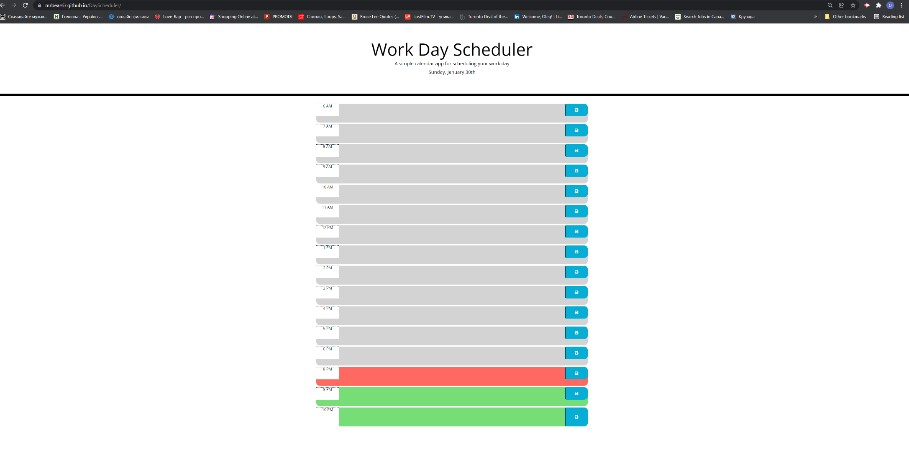

<h>DayScheduler</h>

# Student Id.
Oleg Dobrovolskyi

# Repository Link
https://github.com/MrBearSir/DayScheduler.git

# Deployed Webpage URL
https://mrbearsir.github.io/DayScheduler/

# Project type.
Third-Party APIs Challenge: Work Day Scheduler

# User Story.
AS AN employee with a busy schedule
I WANT to add important events to a daily planner
SO THAT I can manage my time effectively

# Skills used in development.
<ul>
<li>Creating and using DOM and it's Elements</li>
<li>Creating and using elements in DOM with bootstrap classes</li>
<li>Dnamically adding and modifing content in "document."</li>
<li>Working with local storage for storing and getting information</li>
<li>Using jQuery commands to acces and modify elements</li>
<li>Using jQuery commands to change classes</li>
<li>Using MOment.js to modify page in real time</li>
<li>Reffering to element's thru "parent"/"siblings" comands</li>
</ul>